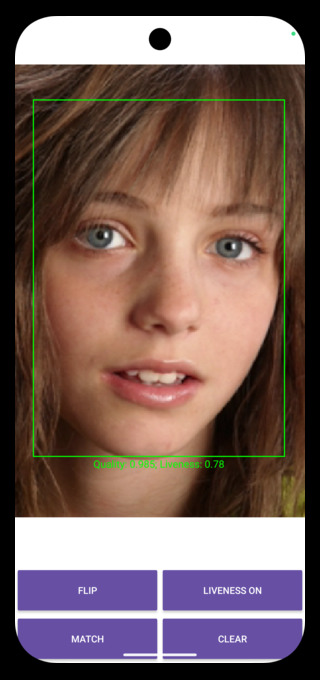
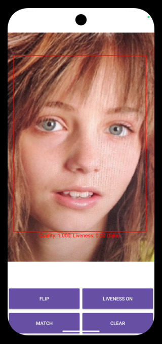

## [FaceSDK](https://www.luxand.com/facesdk/?utm_source=github&utm_medium=readmd&utm_campaign=header) · [CloudAPI](https://luxand.cloud/?utm_source=github&utm_medium=readmd&utm_campaign=header) · [LinkedIn](https://www.linkedin.com/company/luxand-inc.) · [Contact](mailto:support@luxand.com)


<table style="border-collapse: collapse; border: none;">

 

### NIST-approved

Luxand's FaceSDK ranked within the top 21.8% by the National Institute of Standards and Technology (NIST) during the Face Recognition Vendor Test (FRVT).


### iBeta Certified Liveness

The iBeta certified Liveness add-on for FaceSDK aced Level 1 Presentation Attack Detection (PAD) testing, following ISO/IEC 30107-3 standards. 

# FaceSDK \- Android, Java

##   

## Sample

`LiveRecognition` &mdash; live face recognition with liveness detection from the device camera (CameraX), using Luxand FaceSDK 9.0 and the [iBeta Certified Liveness Addon](https://www.luxand.com/facesdk/documentation/certifiedliveness.php).

- Faces are tracked and recognized with the Tracker API; tap a face to assign a name to it.
- Recognized faces are stored in the tracker memory file `tracker90.dat` in the app's external files directory.
- A photo can be matched against the tracker memory.

### Getting Started

1. Open the project in Android Studio.
2. Replace `INSERT THE LICENSE KEY HERE` with your license key in the `FSDK.ActivateLibrary` call in `app/src/main/java/com/example/liverecognition/FacesProcessor.java`.
3. Build and run the app on a device.

The FaceSDK native libraries and the iBeta add-on are in `app/src/main/jniLibs`, the iBeta data files are in `app/src/main/assets/data` (they are copied to the app's cache directory at startup with `FSDK.PrepareData`).

## FaceSDK 9.0 API

FaceSDK 9.0 uses new neural network models for face detection and recognition. The face template size is 1040 bytes. Templates and tracker memory files created with FaceSDK 8.x are not compatible with 9.0.

```java
public static class BBox {
    public TPoint p0 = new TPoint();
    public TPoint p1 = new TPoint();
}

public static class TFace {
    public float score;       // detection confidence, 0..1
    public float angle;       // in-plane rotation angle, degrees
    public BBox bbox = new BBox();
    public TPoint features[] = new TPoint[5];

    public int left(), top(), right(), bottom(), width(), height();
}

public static class TFaces {
    public TFace faces[];
    public int maxFaces;
}
```

*`TFace` replaces the `TFacePosition` class of previous versions. Points `bbox.p0` and `bbox.p1` correspond to top left and bottom right corner coordinates of the face bounding box. `features` contain 5 points detected on the face: eye centers, nose and mouth corners. The 70 facial features (`FSDK_Features`) are returned as `TPointF` (floating point coordinates).*

```java
int FSDK.DetectFace(HImage Image, TFace face);
```

*Detects a single face on the given image. If multiple faces are present, the function returns the one with the highest confidence.*

```java
int FSDK.DetectMultipleFaces(HImage Image, TFaces faces);
```

*Detects multiple faces on the given image. The faces are sorted by confidence in descending order.*

```java
int FSDK.GetFaceTemplate(HImage image, FSDK_FaceTemplate FaceTemplate);
```

*Obtains a face template for the face with the highest confidence on the image (as returned by the `DetectFace` function).*

```java
int FSDK.GetFaceTemplateInRegion(HImage image, TFace face, FSDK_FaceTemplate FaceTemplate);
```

*Obtains a face template for the given `face`.*

### Configuring Face Detection and Recognition

Parameters are set using the `FSDK.SetParameter` or `FSDK.SetParameters` functions (see [documentation](https://www.luxand.com/facesdk/documentation/configuration.php)). For the Tracker API use `FSDK.SetTrackerParameter` and `FSDK.SetTrackerMultipleParameters` (see [documentation](https://www.luxand.com/facesdk/documentation/trackerfunctions.php#FSDK_SetTrackerParameter)). The main parameters are listed below.

#### Face Detection

| Parameter | Description | Default Value | Accepted Values |
| :---      | :---        |     :---:     | :---            |
| FaceDetectionThreshold | Minimum detection score for a face to be reported | 0.64 (Tracker: 0.4) | Floating point value from the range [0, 1] |
| FaceDetectionPatchSize | Size of the square patch the detector works with | 640 (Tracker: 256) | Divisible by 32, minimum 64. Higher values decrease performance, but allow detection of smaller faces |
| FaceDetectionPatchMode | Image patching algorithm to use | fast | <p>`"fast"` &mdash; resizes the image to a single patch</p> <p>`"full"` &mdash; tiles the whole image with patches, finds small faces in large images</p> <p>`"mixed"` &mdash; chooses between the two based on the ratio of the patch size to the image size</p> |
| FaceDetectionBigFaceSize | Size of the whole-image pass used to find faces too large for a single patch | 384 | Positive integer |
| FaceDetectionBatchSize | Number of image patches processed at the same time | 1 | Positive integer |
| TrimOutOfScreenFaces | Discard faces crossing the edges of the image | true | `"true"` or `"false"` |
| FaceDetectionModel | Path to the face detection model file to load | default | File path or the string `"default"` |

The sample uses `FaceDetectionPatchSize=128` for live camera video.

#### Face Recognition

| Parameter | Description | Default Value | Accepted Values |
| :---      | :---        |     :---:     | :---            |
| FaceRecognitionModel | Path to the face recognition model file to load | default | File path or the string `"default"` |
| FaceRecognitionUseFlipTest | Additionally use mirrored image when creating face template | false | `"false"` or `"true"` |
| FaceRecognitionBatchSize | Number of faces processed in one inference call | 1 | Positive integer |
| ComputationDelegate | Computation delegate for all models | cpu | <p>`"none"` &mdash; run on CPU without SIMD optimizations</p> <p>`"cpu"` &mdash; run on CPU with SIMD optimizations</p> <p>`"nnapi"` &mdash; run using [NNAPI](https://developer.android.com/ndk/guides/neuralnetworks)</p> |

## Managing Face Templates in Tracker Memory

The following functions can be used to synchronize Tracker Memory between different devices.

Since the list of IDs in the Tracker may change during operation (for example, two IDs may be merged), it is not recommended to work with the Tracker (i.e., call `FSDK.FeedFrame`) while using the following functions. Also, you must call the following function beforehand (see [FAQ](https://www.luxand.com/facesdk/faq.php)):

```java
FSDK.SetTrackerParameter(tracker, "VideoFeedDiscontinuity", "0");
```
Below is the list of functions for direct access to the Tracker Memory face templates.

```java
int FSDK.GetTrackerIDsCount(HTracker tracker, long[] Count);
```

*Returns the number of `IDs` (persons) in the Tracker's database.*

```java
int FSDK.GetTrackerAllIDs(HTracker tracker, long[] IDList);
```

*Returns a list of all the `IDs` in the Tracker.*

```java
int FSDK.GetTrackerIDByFaceID(HTracker tracker, long FaceID, long[] ID);
```

*Returns the person `ID` for the given `FaceID`. This function may be useful when the person `ID` changes during Tracker operation while the `FaceID` of the template remains unchanged, or when the `ID` is simply unknown. The `FaceID` always remains unchanged.*

```java
int FSDK.GetTrackerFaceIDsCountForID(HTracker tracker, long ID, long[] Count);
```

*Returns the number of face templates in the Tracker's database for the specified `ID` (person).*

```java
int FSDK.GetTrackerFaceIDsForID(HTracker tracker, long ID, long[] FaceIDList);
```

*Returns a list of all the `FaceIDs` for the specified `ID` (person).*

```java
int FSDK.GetTrackerFaceTemplate(HTracker tracker, long FaceID, FSDK_FaceTemplate FaceTemplate);
```

*Returns the face template for the specified `FaceID`.*

```java
int FSDK.TrackerCreateID(HTracker tracker, FSDK_FaceTemplate FaceTemplate, long[] ID, long[] FaceID);
```

*Creates a new person `ID` and adds the provided template to it. Returns the new person `ID` and the associated `FaceID`. `FaceID` may be null, in which case the argument is unused.*

```java
int FSDK.AddTrackerFaceTemplate(HTracker tracker, long ID, FSDK_FaceTemplate FaceTemplate, long[] FaceID);
```

*Adds a new template to an existing person ID and returns the `FaceID`. `FaceID` may be null, in which case the argument is unused.* 

```java
int FSDK.DeleteTrackerFace(HTracker tracker, long FaceID);
```

*Deletes the face template with the specified `FaceID`. If this is the last template for the person, the person `ID` will also be removed.*

```java
int FSDK.GetTrackerFaceImage(HTracker tracker, long FaceID, HImage Image);
```

*Returns the face image for the specified `FaceID`. The dimensions are 112x112. Face images are stored when the `KeepFaceImages` Tracker parameter is `true`. If the image is not present, the function returns the error code `FSDKE_FACEIMAGE_NOT_FOUND`.*

```java
int FSDK.SetTrackerFaceImage(HTracker tracker, long FaceID, HImage Image);
```

*Sets the face image for the specified `FaceID`. The dimensions of the provided `Image` must be 112x112. If an image already exists for the `FaceID`, it will be replaced.*

```java
int FSDK.DeleteTrackerFaceImage(HTracker tracker, long FaceID);
```

*Deletes the face image for the specified `FaceID` from the `tracker's` database. If no image is present, the function does nothing.*

```java
public static class IDSimilarity {
    public long ID;
    public float similarity;
}

int FSDK.TrackerMatchFaces(HTracker tracker, FSDK_FaceTemplate FaceTemplate, float Threshold, IDSimilarity[] Buffer, long[] Count);
```

*Fills `Buffer` with person `IDs` from the `tracker’s` memory that have a face `similarity` score above the `Threshold`. Each entry contains the person `ID` and the respective face `similarity`. Entries are added in descending order, so the `ID` with the highest `similarity` score appears first. The parameter `Count` is set to the number of entries filled into the `Buffer`.*

## iBeta Certified Liveness Addon

The sample uses the [iBeta Certified Liveness Addon](https://www.luxand.com/facesdk/documentation/certifiedliveness.php) for single-frame presentation attack detection. Tap the liveness button to turn liveness detection on or off.

```java
/* Copy the iBeta data files from assets to the cache directory */
FSDK.PrepareData(application);
FSDK.SetParameter("LivenessModel", "external:dataDir=" + application.getCacheDir().getAbsolutePath());

FSDK.SetTrackerMultipleParameters(tracker, "DetectLiveness=true;SmoothAttributeLiveness=false;LivenessFramesCount=1", errorPosition);
```

The Tracker reports the `Liveness` and `ImageQuality` attributes, and `LivenessError` if the liveness check failed. `FSDKE_PLUGIN_NO_PERMISSION` (-31) means that your FaceSDK license key does not permit the iBeta add-on.  

